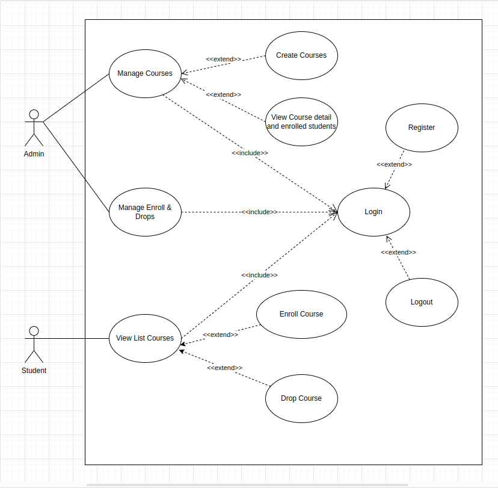

# quiz:
`https://github.com/regov-enterprise/pop-quiz-backend-s-v1`

# Use case:



# Database design:

student

```bash
email
first_name
last_name
username
password
birth_date
phone
```

admin
```bash
email
first_name
last_name
username
password
```

course
```bash
title
capacity
```

course_enroll
```bash
course_id FK course
student_id FK course
created_date
deleted_date
```

# API Flow:

### Student 
```bash
view list course -> /courses GET
enroll course if avaiable -> /courses/enroll POST
drop course enroll if they are in that course, then capa auto update -> /courses/{course_id}/enroll/{enroll_id} PUT
```

### Administrator
```bash
create course + set max capa -> /courses POST
view list course + number of student inside -> /courses GET
view course detail + view student list inside -> /courses/{id} GET
view list drops -> /drops/ GET
```


# Setup:

For framework, i'm using django rest framework

For database, i'm using postgres

For authenticate, i'm using jwt of "djoser"

First of all, you need to run this command to create environment for this project

```bash
`cd project_name`
`python3 -m venv venv`
`source venv/bin/activate`
`pip install -r requirements.txt`
```

If you don't have db yet, please follow this instruction:

```bash
`sudo -i -u postgres psql`
`CREATE DATABASE regov_quiz_v1;`
`CREATE USER fudo4 WITH PASSWORD 'admin123';`
`GRANT ALL PRIVILEGES ON DATABASE regov_quiz_v1 TO fudo4;`
```

Then you need to config db info by:
In tutorial/settings.py file, find `DATABASES` variable and setting postgresdb based on it

```bash
DATABASES = {
    'default': {
        'ENGINE': 'django.db.backends.postgresql',
        'NAME': 'regov_quiz_v1',
        'USER': 'fudo4',
        'PASSWORD': 'admin123',
        'HOST': 'localhost',
        'PORT': '5432',
    }
}
```

After that, run this command to migrate database

`python3 manage.py migrate`

Now, you need to create a new user:

`python3 manage.py createsuperuser`

Run server:

`python3 manage.py runserver`

After finished, you can go to home page `127.0.0.1/8000` to try login

Now, you are good to go

I've post my postman collection in this repo, you can check in `Regov Quiz.postman_collection.json`
